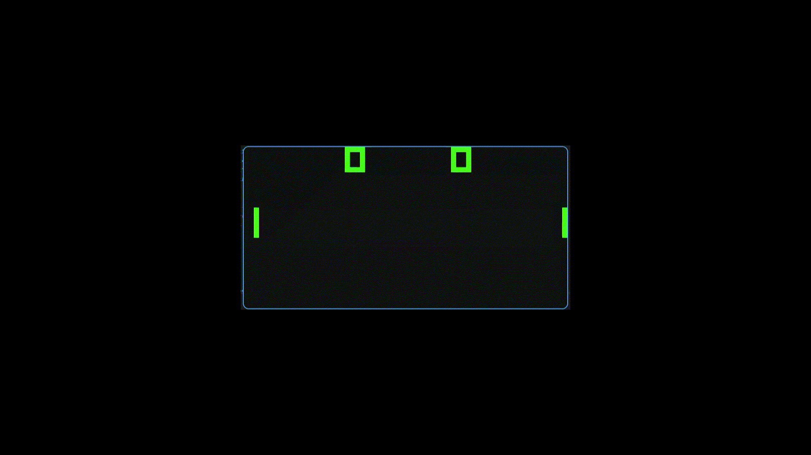

# CHIP-8 Emulator

A minimal CHIP-8 emulator written in Python, in a single file, with no
dependencies beyond `pygame`.

CHIP-8 is an interpreted virtual machine from 1977, originally designed so
hobbyists could write simple games (Pong, Tetris, Space Invaders) without
touching raw machine code. It's widely considered the classic first project
for learning how emulators work — small enough to fully implement in a
weekend, but it still teaches the core ideas: memory, registers, a
fetch-decode-execute loop, and a real instruction set.

## Features

- Full standard CHIP-8 instruction set (all ~35 opcodes)
- 64×32 monochrome display, rendered with pygame
- Hex keypad input, mapped to a standard keyboard layout
- Delay and sound timers running at the correct 60 Hz
- ~200 lines, one file, easy to read start to finish


## Demo



## Getting started

### Requirements

- Python 3.9+
- pygame

### Run

```bash
python main.py path/to/rom.ch8
```

## Controls

The original CHIP-8 hex keypad, mapped onto a standard keyboard:

```
CHIP-8 Keypad          Your Keyboard
1  2  3  C              1  2  3  4
4  5  6  D       ->      Q  W  E  R
7  8  9  E                A  S  D  F
A  0  B  F                Z  X  C  V
```

`Esc` or closing the window quits.

## Getting ROMs

This repo intentionally ships without ROMs (most are copyrighted or
redistributed under separate licenses). Good public sources:

- [kripod/chip8-roms](https://github.com/kripod/chip8-roms) — the standard
  classic games/demos/programs pack
- [JohnEarnest/chip8Archive](https://github.com/JohnEarnest/chip8Archive) —
  a curated archive including modern homebrew CHIP-8 games
- [corax89/chip8-test-rom](https://github.com/corax89/chip8-test-rom) and
  [Timendus/chip8-test-suite](https://github.com/Timendus/chip8-test-suite) —
  test ROMs for verifying opcode correctness

## How it works

The whole emulator is one loop, repeated ~60 times a second:

1. **Fetch** — read the 2-byte instruction at the program counter
2. **Decode** — split it into the register/value fields it encodes
3. **Execute** — run the matching operation (jump, math, draw, etc.)
4. **Tick timers** — count down the delay/sound timers at a fixed 60 Hz
5. **Draw** — if the screen changed, render it

Sprites are drawn by XOR-ing pixels onto the display rather than overwriting
them — draw the same sprite twice and it erases itself, and if XOR-ing ever
clears a pixel that was already lit, that means two sprites overlapped. That
single mechanic is CHIP-8's entire collision-detection system.

## Known limitations / roadmap

This is a deliberately minimal reference implementation. Things not yet
included, and open to contributions:

- [ ] Sound (the sound timer exists but isn't wired to actual audio output)
- [ ] Configurable CPU speed / window scale via CLI flags
- [ ] Quirk toggles for `8XY6`/`8XYE` (shift) and `FX55`/`FX65`
      (load/store), which different original interpreters implemented
      inconsistently
- [ ] SUPER-CHIP support (128×64 display, extra opcodes)
- [ ] Save states
- [ ] A step-through debugger / disassembler

## References

- [Cowgod's CHIP-8 Technical Reference](http://devernay.free.fr/hacks/chip8/C8TECH10.HTM) — the de facto spec
- [Timendus/chip8-test-suite](https://github.com/Timendus/chip8-test-suite) — for verifying correctness

## License

MIT — see [LICENSE](LICENSE).
